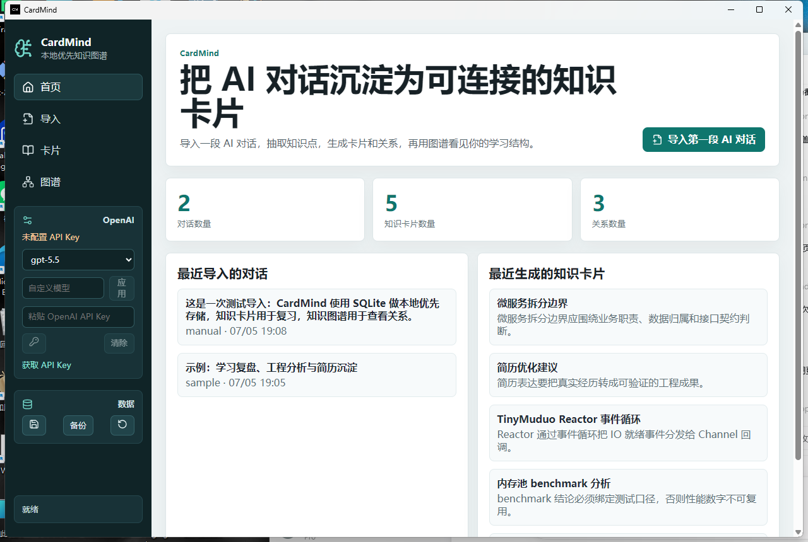
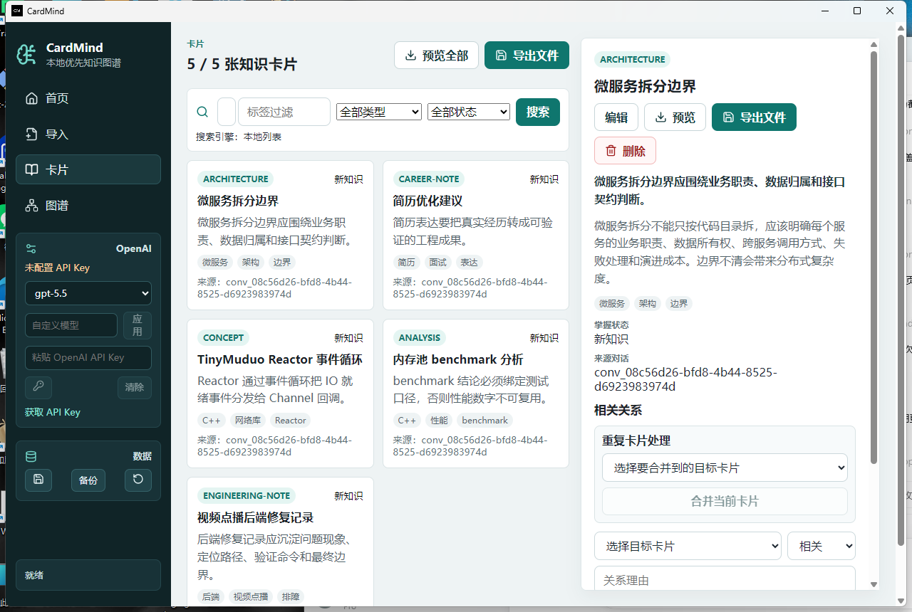
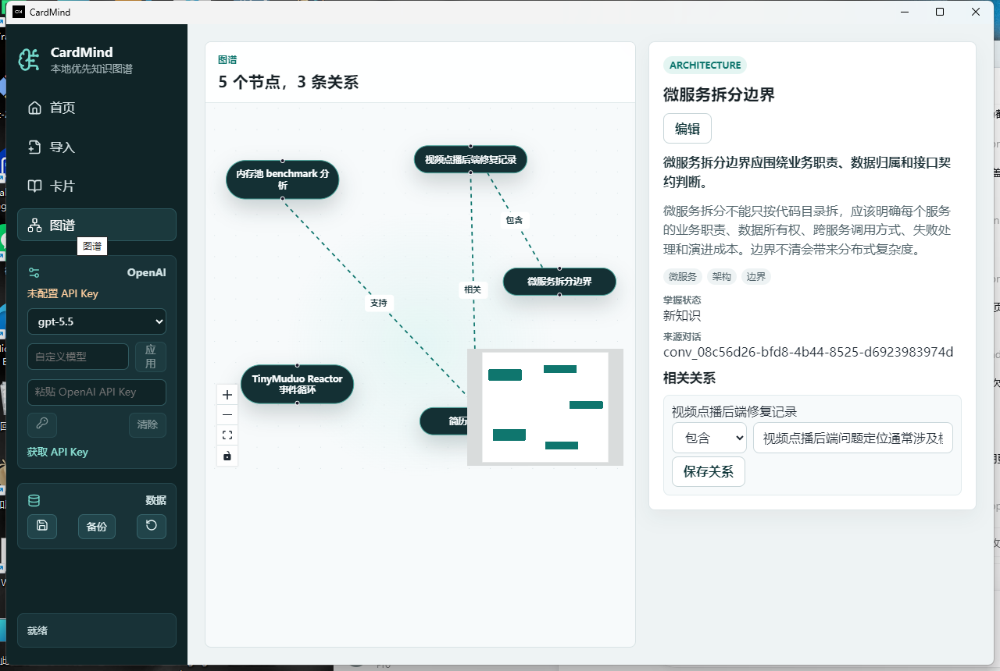

# CardMind

CardMind is a local-first desktop MVP that turns useful AI conversation fragments into structured knowledge cards, searchable notes, Markdown exports, and a lightweight personal knowledge graph.

中文定位：CardMind 面向个人学习、项目复盘和面试准备。它不是普通聊天归档，也不是 Markdown-first 笔记软件；原始 AI 对话只是来源材料，核心数据是 SQLite 中的 `Conversation`、`KnowledgeCard` 和 `CardRelation`。

## Why

AI 对话很容易越积越多，但整段聊天记录很难复习、检索和复用。CardMind 的目标是把对话里的有效知识点拆成卡片，让用户先预览，再确认保存，最后通过搜索、导出和图谱继续使用这些知识。

## Current MVP

- 导入原始 AI 对话，支持手动粘贴和轻量文件导入（txt / md / json / html）。
- 使用 OpenAI Responses API 抽取候选知识卡片和关系；未配置 API Key 或调用失败时回退本地 mock extractor。
- 用户先编辑 Extraction Preview，再确认写入 SQLite。
- 浏览、搜索、编辑、删除和合并 Knowledge Cards。
- 手动新增、编辑、删除 CardRelation。
- 使用 SQLite FTS5 优先的本地关键词检索，环境不支持 FTS5 或查询无法解析时退化为 LIKE 搜索。
- 导出单张卡片或全部卡片为 Markdown 文本，也可写入本地文件。
- 使用 React Flow 展示 KnowledgeCard / CardRelation 图谱。
- 一键加载 demo 数据，覆盖工程复盘、benchmark、TinyMuduo、简历优化和微服务边界场景。
- 创建和恢复 SQLite 数据库备份，备份文件保存在用户文档目录下的 `CardMind/backups`。

## Tech Stack

- Frontend: React, TypeScript, Vite, React Flow
- Desktop runtime: Tauri v2
- Backend: Rust Tauri commands
- Database: SQLite / rusqlite
- AI extraction: OpenAI Responses API with local mock fallback
- Legacy prototype: `apps/api` Express + SQLite, retained only as an early local API prototype

## Architecture

```text
AI Conversation
      |
      v
Extraction Preview
      |
      v
Knowledge Cards ---- Relations
      |                    |
      v                    v
Search / Export        Graph View
```

## Data Flow

1. 导入原始 AI 对话。
2. 调用 OpenAI 或 mock extractor 生成候选卡片和关系。
3. 用户预览并可编辑抽取结果。
4. 用户确认保存。
5. SQLite 持久化 Conversation、KnowledgeCard、CardRelation。
6. 前端展示卡片列表、图谱、搜索结果和 Markdown 导出。

## Local-First Boundary

- SQLite 是核心存储，Markdown 只是导出格式。
- API Key 不写入 SQLite；优先读取 `OPENAI_API_KEY`，也可保存到 Windows Credential Manager。
- 原始对话默认只保存在本地 SQLite。
- 只有用户配置 OpenAI API Key 并主动触发抽取时，对话内容才会被发送给 OpenAI。
- 不包含云同步、登录系统、RAG、向量数据库或复杂知识推理。

## Screenshots

截图文件位于 `docs/screenshots/`。如果本地数据库不同，数字和卡片内容会略有差异。





## Run Locally

```powershell
pnpm install
pnpm tauri dev
```

Build the desktop installer:

```powershell
pnpm build:desktop
```

Expected Windows installer output:

```text
src-tauri\target\release\bundle\nsis\CardMind_0.1.0_x64-setup.exe
```

## OpenAI API Setup

Option 1: set an environment variable.

```powershell
setx OPENAI_API_KEY "your_api_key_here"
```

Option 2: paste the key in the CardMind sidebar. It is stored in Windows Credential Manager, not SQLite.

Create or manage keys at [OpenAI API keys](https://platform.openai.com/api-keys).

The settings UI includes model presets and a custom model input. Use a model that is available to your OpenAI account; when OpenAI fails, CardMind keeps the product usable with local mock extraction and shows a warning.

## Verification

Fast verification:

```powershell
pnpm verify
```

Useful individual commands:

```powershell
pnpm --recursive check
cargo check --manifest-path src-tauri/Cargo.toml
cargo test --manifest-path src-tauri/Cargo.toml
pnpm eval:extractor
git diff --check
```

Desktop build:

```powershell
pnpm build:desktop
```

## Demo

See [docs/demo.md](docs/demo.md).

In a clean database, open the app and click “加载示例数据”. The demo creates cards about:

- 视频点播后端修复记录
- 内存池 benchmark 分析
- TinyMuduo Reactor 事件循环问答
- 简历优化建议
- 微服务拆分边界

Then try Cards search, relation editing, card merge, Markdown export, backup, and Graph view.

## Current Limitations

- OpenAI extraction quality is MVP-level and still needs prompt/evaluation tuning.
- Search is keyword-based; it is not semantic search.
- File import is a lightweight adapter, not a complete parser for every chat export format.
- Card merge is simple content-and-relation migration, not semantic deduplication.
- Backup/restore is local-file based; it is not cloud sync.
- Legacy `apps/api` remains in the repository but is not the desktop runtime path.

## Roadmap

- Improve extraction evaluation with more realistic fixtures.
- Add richer import adapters for ChatGPT/Claude/Gemini export formats.
- Add lightweight review workflows for learning status.
- Improve release automation and signed Windows installer delivery.
- Consider semantic search only after the local-first MVP is stable.

## Interview Talking Points

- Designed a local-first desktop MVP using Tauri, React, Rust commands, and SQLite.
- Split AI conversation import from structured knowledge storage: Conversation is source material, KnowledgeCard is the reusable unit.
- Implemented preview-before-persist flow so generated cards are not silently written to the database.
- Added OpenAI extraction with mock fallback and kept API Key out of SQLite/plain frontend logs.
- Added SQLite-backed search, Markdown export, demo data, relation maintenance, card merge, backup/restore, and verification scripts to close a realistic MVP loop.
